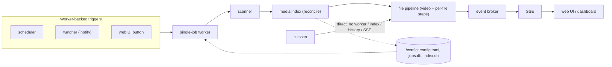

# Subtitle tool

Self-hosted tool that keeps the subtitle side of a Plex media library clean: external UTF-8 SRT
files, correct language codes in filenames Plex understands, junk lines removed, and embedded
subtitles extracted where wanted. Configured once through a web UI, then runs unattended. Hobby
tool: favor a small codebase, few moving parts, and behavior that is easy to reason about over
configurability.

One process, one container: a FastAPI web app, a scheduler, an inotify watcher, a single-job worker,
a scanner, and an idempotent file pipeline. There is no per-file state database; the filesystem is
the source of truth. Persisted state is one TOML config file and a SQLite job history, both under
`/config`. See [docs/architecture.md](docs/architecture.md) for the full design.



## Project Layout

- `src/subtitle_tool/` - the package. See `src/subtitle_tool/CLAUDE.md` for the subpackage map, the
  scan data flow, and package-editing invariants.
- `tests/` - pytest suite mirroring the package. Shared, test-local setup lives in
  `tests/helpers.py` (fixture builders, `media_config`, `RecordingBroker`, worker wait loops, the
  `Gate`/`block_worker_scan` blocking-scan controls) and `tests/conftest.py` (the web `client`
  fixture); these are not part of the package's public API.
- `docs/` - architecture and requirements (see below).
- `frontend/` - npm manifest, lockfile, and `refresh-alpine.mjs` that pin Alpine.js and refresh the
  vendored static asset. Dependency-tracking and vendor-refresh tooling only (so Dependabot can
  watch Alpine and `npm run vendor` can update the committed file); not a runtime or application
  build step. `frontend/node_modules/` is gitignored.
- `Dockerfile`, `docker/entrypoint.sh`, `docker-compose.yml` - container image bundling ffmpeg,
  dropping to PUID/PGID via gosu.
- `.github/workflows/` - `ci.yml` (a `lint` job for ruff + Markdown format/lint, then a `test` job
  for pytest with the coverage gate that runs only after `lint` passes via `needs`), `docker.yml`
  (image build and GHCR publish). A future Playwright browser suite (issue #114) can be added as a
  `test-ui` job that also depends on `lint`, or as a separate `test-ui.yml`.

## Development

The project uses [uv](https://docs.astral.sh/uv/).

```sh
uv sync --extra dev          # create or update the environment
uv run pytest                # run the tests
uv run pytest --cov          # run the tests with the coverage gate
uv run ruff check            # lint
uv run ruff format --check   # check formatting (drop --check to apply)
uv run mdformat --check $(git ls-files '*.md')   # markdown format check
uv run pymarkdown scan $(git ls-files '*.md')    # markdown lint
```

`uv run pytest --cov` measures coverage for the application package only (`src/subtitle_tool`) and
fails when it drops below the `fail_under` threshold in `pyproject.toml`'s `[tool.coverage.report]`.
CI and the `pre-push` git hook run this same gate, so the threshold lives in one place.

Markdown is held to the same 100-column limit as the Python code: `mdformat` reflows `*.md` (config
in `.mdformat.toml`) and `pymarkdown` lints it (MD013 at 100 in `pyproject.toml`'s
`[tool.pymarkdown]`). The pre-commit hook formats staged Markdown and pre-push plus CI re-check the
whole tree.

The video pipeline and some tests need the `ffmpeg`/`ffprobe` binaries, and browser tests need
Playwright's Chromium. Locally, install ffmpeg with your package manager and run
`uv run playwright install --with-deps chromium`.

Cloud coding environments (Claude Code on the web, Codex cloud) start from a base image without
these, so configure `scripts/setup-cloud.sh` as the environment's setup script. It installs ffmpeg
and the GitHub CLI, syncs dev dependencies, installs Playwright Chromium, and wires up the git
hooks; both platforms run the setup script as root with network access and cache the result. Set the
setup-script field to `bash scripts/setup-cloud.sh` in the Claude Code web environment settings and
in Codex Settings -> Environments. The narrower `scripts/setup-githooks.sh` only configures git
hooks and is for local use.

Bootstrap settings come from environment variables only: `CONFIG_DIR`, `PORT`, `PUID`, `PGID`, `TZ`,
`BROWSE_ROOT` (the root the config UI directory picker is confined to, default `/`). Everything else
lives in the TOML config file under `CONFIG_DIR` and is validated on load.

Run the web UI (the default command) or a one-off scan from the CLI:

```sh
uv run subtitle-tool                                 # serve the web UI on PORT
uv run subtitle-tool scan /path/to/media --dry-run   # report planned actions
uv run subtitle-tool scan /path/to/media             # apply changes
uv run subtitle-tool scan --config /config/config.toml
```

The UI configures the tool (config page), triggers scans (dashboard buttons), streams live job
progress over Server-Sent Events, and shows job history from the SQLite store under `CONFIG_DIR`.
Scans run on a single background worker.

The web UI stack is server-rendered Jinja/FastAPI as the source of truth, with Alpine.js as a thin
local-interaction layer for page-local state only (config language and directory pickers, library
"show gaps only" toggle). This is an intentional part of the stack, not an accident to refactor
away. Preserve the split: keep navigation, persistence, and validation server-side; use named
`Alpine.data(...)` components in `app.js` for transient in-page interactivity; do not turn the UI
into an SPA or add a frontend bundler/build step. Alpine is the pinned `@alpinejs/csp` build
vendored under `src/subtitle_tool/web/static/vendor/`; because the CSP build forbids inline
expression evaluation, keep template expressions to property/method references and put logic in the
components. To bump it, let Dependabot update `frontend/package.json`/`package-lock.json`, then run
`npm ci && npm run vendor` from `frontend/` to refresh the committed static asset. Do not add Alpine
as a Git submodule.

Project-owned web styles are a small, ordered set of plain CSS files under
`src/subtitle_tool/web/static/css/` (`tokens.css`, then `base.css`, `components.css`, `forms.css`,
`tables.css`), loaded directly by `base.html` with explicit `<link>` tags in that dependency order.
Shared visual values live in `tokens.css` as CSS custom properties before reuse. Do not add a CSS
framework, preprocessor, bundler, or build step. That CSS is linted locally with Stylelint through a
single pinned `npx` command (config at `tools/stylelint.config.cjs`, not added to `package.json`),
run by the `scripts/pre-commit/40-css.sh` and `scripts/pre-push/40-css.sh` git hooks when project
CSS is touched; it is hook-only and deliberately not a CI step. Vendored assets under
`static/vendor/` are never edited or linted as project-owned CSS. See
`src/subtitle_tool/web/AGENTS.md` for the full web UI conventions.

## Docs

- [Architecture](docs/architecture.md): operating model, components, pipeline, safety rules, and
  technology choices.
- [Functional Requirements](docs/functional-requirements.md): user-facing capabilities and
  configuration behavior.
- [Technical Requirements](docs/technical-requirements.md): implementation constraints, runtime
  behavior, and operational requirements.
- [Design Requirements](docs/design-requirements.md): visual direction, interaction principles,
  accessibility constraints, design tokens, and CSS-reuse rules for the web UI.

When a change alters behavior, update this AGENTS.md so the Project Layout, Development, and any
changed conventions reflect the new reality; a stale AGENTS.md is a defect.

ALWAYS keep track of troubleshooting progress in a troubleshooting case file in
`docs/troubleshooting/<DATE>_<SUBJECT>.md`. While troubleshooting, append the steps taken to the
troubleshooting case file. For example,
`echo 'pinged 1.1.1.1, ping is ok' >> docs/troubleshooting/<DATE>_<SUBJECT>.md`

## Git

Commit in small increments, but no meaningless micro-commits. "WIP"/vague messages forbidden.
Checkpoints must stay local or on scratch branch until green and reviewable. Before PR/merge:
rebase/squash to atomic, green, conventional, documentation-grade commits. Each commit must contain
one logical change only. Do not mix unrelated changes, refactors with behavior changes, or
formatting with functional changes. Each commit must be independently checkable and in working
state. Required Commit Body Sections for non-trivial commits:

- Context: What problem/need triggered this
- Change: High-level summary of what changed
- Rationale: Why this approach, trade-offs, alternatives rejected
- Impact/Risk: Behavior changes, migrations, compatibility, performance
- Tests: Exact command(s) run (e.g., `Tests: cd src && uv run pytest tests/`) Subject: imperative
  mood ("add", "fix"), ~50 chars, no period.

Body: blank line after subject, explain what/why (not how), wrap ~72 chars. Body required for
non-trivial changes. Use Conventional Commits format: `type(scope?): subject`

Allowed types: `feat, fix, docs, refactor, test, perf, build, ci, chore, style, revert`

Breaking changes: use `type(scope)!: subject` OR `BREAKING CHANGE: ...` footer with migration steps.
MUST NOT add author/co-author attribution trailers for AI. Forbidden: `Co-authored-by:`,
`Generated-by:`, `AI-Generated-by:`, `Assisted-by:`, `Model:`. Allowed trailers: `Fixes #...`,
`Refs #...`, `BREAKING CHANGE:...`, `Signed-off-by:` (human only). MUST run tests before every
commit (minimum: fast suite or targeted tests for changed area). EACH COMMIT MUST KEEP REPO GREEN:
build passes, tests pass. Failing commits are forbidden on shared branches. Intermediate failing
steps must stay local and be squashed before PR/merge. Every PR MUST reference a GitHub issue
whenever one applies, using a closing keyword (`Fixes #...`, `Closes #...`, `Resolves #...`) in the
PR body so the issue closes automatically on merge.

## Writing Style

Maximize information density, while making text effortless to read Never use bold formatting in
markdown text, unless the info is absolutely critical NEVER use emojis anywhere, but rather use
[ERROR], [WARNING], [INFO] or something else in brackets Keep markdown and text headings unnumbered
