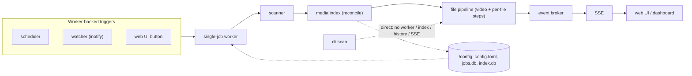

# Subtitle tool

Self-hosted tool that keeps the subtitle side of a Plex media library clean: external UTF-8 SRT
files, correct language codes in filenames Plex understands, junk lines removed, and embedded
subtitles extracted where wanted. Configured once through a web UI, then runs unattended. Hobby
tool: favor a small codebase, few moving parts, and behavior that is easy to reason about over
configurability.

One process, one container: a FastAPI web app, a scheduler, an inotify watcher, a single-job worker,
a scanner, and an idempotent file pipeline. There is no per-file state database; the filesystem is
the source of truth. Persisted state is one TOML config file and a SQLite job history, both under
`/config`. See [docs/architecture.md](docs/architecture.md) for the full design.



## Repository layout

```text
.
├── src/subtitle_tool/  # the package: scanner, pipeline, jobs, index, web  (own AGENTS.md)
├── tests/              # pytest suite mirroring the package; tests/browser/ is Playwright
├── docs/               # architecture + requirements, backlog/, troubleshooting/
├── frontend/           # Alpine.js pin + vendor-refresh tooling only (no runtime build)
├── tools/              # repo tooling configs (Stylelint)
├── .githooks/          # tracked git hooks: hooks/ runners + per-hook check scripts
├── .github/            # CI workflows + setup-env composite action
├── scripts/            # environment setup (setup-cloud.sh, setup-githooks.sh)
└── docker/             # entrypoint; with Dockerfile + docker-compose.yml builds the image
```

- `tests/` mirrors the package; shared test-local setup lives in `tests/helpers.py` and
  `tests/conftest.py` (not package public API). `tests/browser/` is marked `browser` and deselected
  by default (`-m "not browser"`), so it stays out of `uv run pytest` and the coverage gate; run it
  with `uv run pytest -m browser`.
- `.github/workflows/`: `lint.yml` (ruff + Markdown), `test.yml` (pytest + coverage gate, sharded),
  `test-ui.yml` (Playwright, Chromium-only, separate from the coverage gate), `docker.yml` (build +
  GHCR publish). All run on PRs and pushes to `main`/tags; a `concurrency` group cancels superseded
  PR runs but never `main`/tag runs. Shared uv/python/sync setup is the `setup-env` composite
  action.

## Separation of Concerns

Keep each module to one job; this is a standing expectation for new work, not just a one-time
cleanup. Favour small, focused, independently testable units over modules that quietly grow a second
responsibility. When you touch code, leave its boundaries at least as clean as you found them.

- Shared domain logic lives in a neutral module, never inside a feature package that happens to be
  its first caller. Subtitle-filename parsing is in `src/subtitle_tool/subtitle_names.py` (used by
  the scanner, index, and pipeline) rather than under `scanner/`, so no single caller owns it. If a
  helper is imported across packages, it belongs in a neutral home.
- Orchestration modules orchestrate; they do not accumulate presentation, reporting, or payload
  shaping. The job worker (`jobs/worker.py`) drives the run and delegates counters, result-to-store
  mapping, and SSE payload shaping to `jobs/reporting.py`. The web app factory (`web/app.py`) is a
  composition root: lifecycle wiring and route handlers, with page/API logic in helpers
  (`web/library_view.py`, `web/browse.py`, `web/health.py`).
- The web UI stays server-rendered FastAPI/Jinja with Alpine.js as a thin local layer; extracting
  route helpers must not introduce an SPA, a client-side router, or a frontend build step.
- When a module starts doing two things, extract the second into a focused helper with its own
  tests, and update the package map in `src/subtitle_tool/AGENTS.md` to record the new boundary. A
  helper that carries logic gets unit tests of its own, not only coverage through its caller.

## Development

The project uses [uv](https://docs.astral.sh/uv/).

```sh
uv sync --extra dev          # create or update the environment
uv run pytest                # run the tests (the browser suite is deselected)
uv run pytest --cov          # run the tests with the coverage gate
uv run pytest -m browser     # run only the Playwright browser suite (needs Chromium)
uv run ruff check            # lint
uv run ruff format --check   # check formatting (drop --check to apply)
uv run mdformat --check $(git ls-files '*.md')   # markdown format check
uv run pymarkdown scan $(git ls-files '*.md')    # markdown lint
```

- Coverage: `uv run pytest --cov` measures the application package only (`src/subtitle_tool`) and
  fails below the `fail_under` threshold in `pyproject.toml`'s `[tool.coverage.report]`. CI and the
  `pre-push` hook run this same gate, so the threshold lives in one place.
- Markdown: held to the same 100-column limit; `mdformat` reflows `*.md` (config `.mdformat.toml`)
  and `pymarkdown` lints it (MD013 at 100 in `[tool.pymarkdown]`).
- Binaries: the video pipeline and some tests need `ffmpeg`/`ffprobe`; browser tests need
  Playwright's Chromium. Locally install ffmpeg with your package manager and run
  `uv run playwright install --with-deps chromium`.
- Cloud setup: Claude Code on the web and Codex cloud start without these, so set
  `bash scripts/setup-cloud.sh` as the environment setup script (installs ffmpeg + GitHub CLI, syncs
  dev deps, installs Chromium, wires up the git hooks). `scripts/setup-githooks.sh` only configures
  git hooks, for local use.
- Bootstrap settings come from environment variables only: `CONFIG_DIR`, `PORT`, `PUID`, `PGID`,
  `TZ`, `BROWSE_ROOT` (config UI directory-picker root, default `/`). Everything else lives in the
  TOML config under `CONFIG_DIR`, validated on load.

Run the web UI (the default command) or a one-off scan from the CLI:

```sh
uv run subtitle-tool                                 # serve the web UI on PORT
uv run subtitle-tool scan /path/to/media --dry-run   # report planned actions
uv run subtitle-tool scan /path/to/media             # apply changes
uv run subtitle-tool scan --config /config/config.toml
```

- Web UI: server-rendered Jinja/FastAPI is the source of truth; Alpine.js (pinned `@alpinejs/csp`
  build, vendored under `src/subtitle_tool/web/static/vendor/`) is a thin local layer for page-local
  state only. Project-owned styles are a small ordered set of plain CSS under `web/static/css/`. Do
  not turn the UI into an SPA or add a CSS framework, preprocessor, bundler, or build step. See
  `src/subtitle_tool/web/AGENTS.md` for full web UI/CSS/Stylelint conventions; bump Alpine via
  Dependabot then `npm ci && npm run vendor` from `frontend/`.

## Docs

- [Architecture](docs/architecture.md): operating model, components, pipeline, safety rules, and
  technology choices.
- [Functional Requirements](docs/functional-requirements.md): user-facing capabilities and
  configuration behavior.
- [Technical Requirements](docs/technical-requirements.md): implementation constraints, runtime
  behavior, and operational requirements.
- [Design Requirements](docs/design-requirements.md): visual direction, interaction principles,
  accessibility constraints, design tokens, and CSS-reuse rules for the web UI.

## AGENTS.md and CLAUDE.md

- Every `AGENTS.md` opens with a directory tree of the subtree below it, each entry carrying a short
  `#` comment; descend only until a child has its own `AGENTS.md` (that file documents its subtree).
- Every `AGENTS.md` carries at least one Mermaid diagram showing what the tree cannot (control/data
  flow, pipelines, state machines), wrapped in a ```` ```mermaid ```` block. Do not redraw the
  folder layout. Keep it current as behavior changes.
- Keep each `AGENTS.md` under 250 lines; when it grows past that, move directory-specific detail
  into a nested `AGENTS.md` in the right child and leave a short pointer. Refresh a file once its
  directory drifts ~1000 LOC. Root owns repo-level layout, commands, and conventions; nested files
  own their subtree. Keep them non-overlapping; a stale `AGENTS.md` is a defect.
- Each directory with an `AGENTS.md` also holds a `CLAUDE.md` symlink to it
  (`ln -s AGENTS.md CLAUDE.md`). Commit the link, never a copy, so agents and Claude Code read one
  file.

## Code Quality

- Enforce every rule a machine can check: fast checks in the git hooks (see Git), CI as the backstop
  on every PR. Do not rely on people remembering a rule.
- Keep the repository root clean: files defining a package, build, test, lint, or secret-scanning
  setup live in a purpose-named directory (`tools/<name>/` for tooling, the package dir for product
  code), not scattered at root. Python's `pyproject.toml` is the package manifest and stays at root
  per ecosystem standard; the Stylelint config lives in `tools/`.
- Every language has a linter and an auto-formatter, Markdown included: ruff (Python), mdformat plus
  pymarkdown (Markdown), Stylelint (CSS). Linting is strict — strictest ruleset, warnings as errors,
  no rule disabled or downgraded to pass; fix the underlying issue. An inline suppression is a last
  resort and needs a specific rule code plus a comment explaining why. Any violation fails the
  build.
- No hand-written file exceeds 600 lines; no hand-written line exceeds 100 columns. Split or wrap
  instead of packing more in. Generated and vendored files (lock files, minified bundles,
  `static/vendor/`) are exempt; unbreakable tokens like URLs or hashes are the only in-source
  exception.

## Git

- Commit in small increments, but no meaningless micro-commits; "WIP"/vague messages forbidden.
  Checkpoints stay local or on a scratch branch until green and reviewable. Before PR/merge:
  rebase/squash to atomic, green, conventional, documentation-grade commits.
- Each commit contains one logical change only; do not mix unrelated changes, refactors with
  behavior changes, or formatting with functional changes. Each commit is independently checkable
  and in working state.
- Non-trivial commits need a body with these sections:
  - Context: What problem/need triggered this
  - Change: High-level summary of what changed
  - Rationale: Why this approach, trade-offs, alternatives rejected
  - Impact/Risk: Behavior changes, migrations, compatibility, performance
  - Tests: Exact command(s) run (e.g., `Tests: cd src && uv run pytest tests/`)
- Subject: imperative mood ("add", "fix"), ~50 chars, no period. Body: blank line after subject,
  explain what/why (not how), wrap ~72 chars; required for non-trivial changes.
- Use Conventional Commits `type(scope?): subject` with types
  `feat, fix, docs, refactor, test, perf, build, ci, chore, style, revert`. Breaking changes use
  `type(scope)!: subject` or a `BREAKING CHANGE:` footer with migration steps.
- MUST NOT add AI author/co-author attribution trailers. Forbidden: `Co-authored-by:`,
  `Generated-by:`, `AI-Generated-by:`, `Assisted-by:`, `Model:`. Allowed: `Fixes #...`, `Refs #...`,
  `BREAKING CHANGE:...`, `Signed-off-by:` (human only).
- Link issues via footer (`Fixes #123` / `Refs #123`); if no issue exists, the body states the why.
  Every PR references its issue with a closing keyword (`Fixes #...`, `Closes #...`,
  `Resolves #...`) so it closes on merge.
- MUST run tests before every commit (minimum: fast suite or targeted tests for the changed area).
  Each commit keeps the repo green (build passes, tests pass). Failing commits are forbidden on
  shared branches; intermediate failing steps stay local and are squashed before PR/merge.
- Hooks are tracked in `.githooks/`, never private `.git/hooks`; configure each checkout with
  `git config core.hooksPath .githooks/hooks` (run `scripts/setup-githooks.sh`). The entrypoints
  `.githooks/hooks/<hook>` are tiny POSIX-sh runners: execute every executable script in the
  matching `.githooks/<hook>/` directory in sorted order, forward hook args, and stop on the first
  failure.
- Real checks are numbered scripts (`10-loc.sh`, `20-lint.sh`, `30-tests.sh`, `40-css.sh`):
  pre-commit runs fast staged checks, pre-push the full suite plus coverage gate. CI is the final
  backstop.

## Project Docs

- Tasks are Markdown files in `docs/backlog/<index>_<task-slug>.md`, moved across `open/` →
  `pending-review/` → `done/` as status changes. Short-lived in-flight work goes in `docs/todo.md`
  (`- [ ]` open, `- [~]` in progress, `- [x]` done).
- ALWAYS keep troubleshooting progress in a case file `docs/troubleshooting/<DATE>_<SUBJECT>.md`,
  appending each step as you go, for example:
  `echo 'pinged 1.1.1.1, ping is ok' >> docs/troubleshooting/<DATE>_<SUBJECT>.md`

## Writing Style

Governs committed Markdown and docs:

- Maximize information density while keeping text effortless to read.
- Never use bold in Markdown text unless the info is absolutely critical.
- NEVER use emojis; use `[ERROR]`, `[WARNING]`, `[INFO]` or similar in brackets instead.
- Keep Markdown and text headings unnumbered.

## Writing Caveman

For working output and notes, compress:

- Abbreviate common prose words (DB, auth, config, req, res, fn, impl); strip conjunctions; one word
  where one word does the job.
- Use arrows for causality (X -> Y) instead of connective phrasing.
- Drop articles (a/an/the), filler (just/really/basically/actually/simply), pleasantries, and
  hedging.
- Prefer short synonyms ("big" not "extensive", "fix" not "implement a solution for"); sentence
  fragments are fine.
- Never abbreviate code symbols, function names, API names, or error strings — keep those verbatim.
