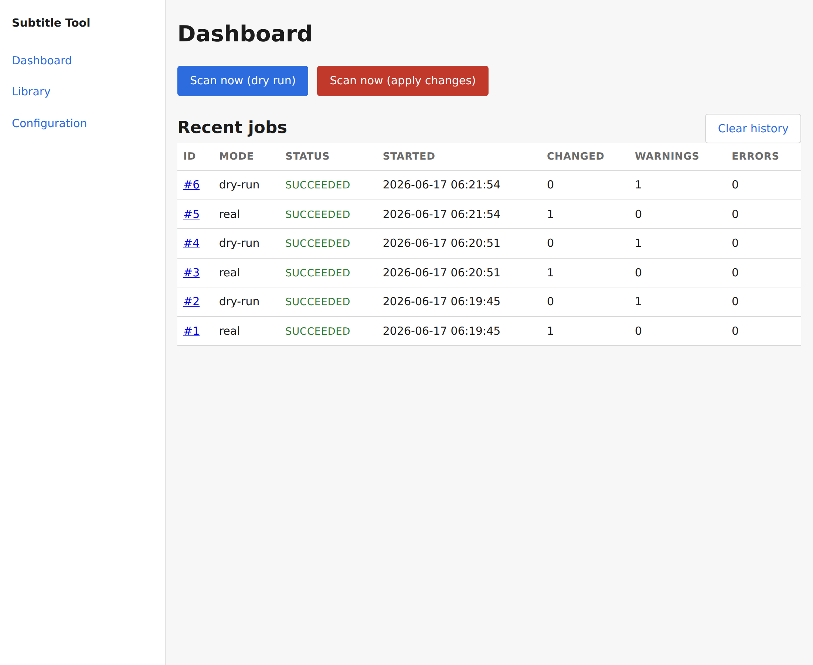
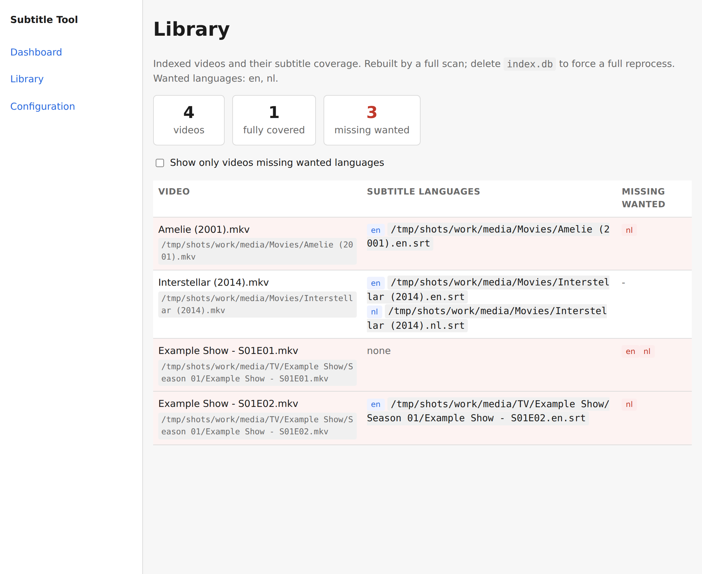
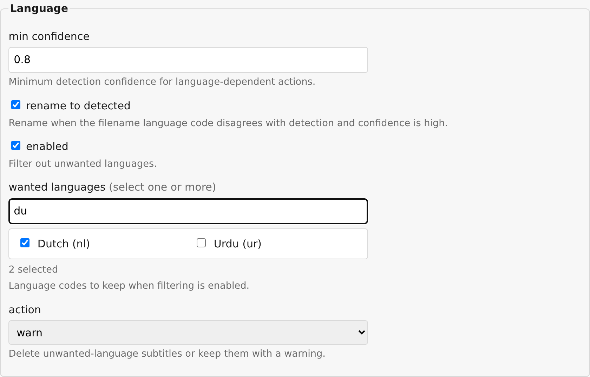

# Subtitle Tool

Self-hosted tool that keeps the subtitle side of a Plex media library clean:
external UTF-8 SRT files, correct language codes in filenames Plex understands,
junk lines removed, and embedded subtitles extracted where wanted.

See [docs/architecture.md](docs/architecture.md) for the design.

## Development

The project uses [uv](https://docs.astral.sh/uv/) for dependency management.

```sh
uv sync --extra dev      # create the environment
uv run pytest            # run the tests
uv run ruff check        # lint
uv run ruff format       # format
```

## Configuration

Bootstrap settings come from environment variables only: `CONFIG_DIR`, `PORT`,
`PUID`, `PGID`, `TZ`, and `BROWSE_ROOT` (the root the config UI directory picker is
confined to, default `/`). Everything else lives in a TOML config file in the
config directory (default `/config/config.toml`) and is validated on load; see
`src/subtitle_tool/config/`.

## Web UI

`subtitle-tool` with no arguments serves the web UI on `PORT`. From the browser
you configure every setting (config page, validated and written atomically),
trigger a scan in dry-run or apply mode (dashboard buttons), watch job progress
update live over Server-Sent Events, and browse past jobs with their per-file
actions and warnings. Job history lives in a SQLite database under `CONFIG_DIR`.

```sh
uv run subtitle-tool                                 # serve the UI
uv run subtitle-tool scan /path/to/media --dry-run   # or a one-off CLI scan
```

### Screenshots

The dashboard triggers scans, shows live progress, and lists recent jobs with a
button to clear history.



The library view summarizes subtitle coverage and can filter to videos still
missing a wanted language.



Wanted languages are picked from a filterable checkbox list on the configuration
page.


