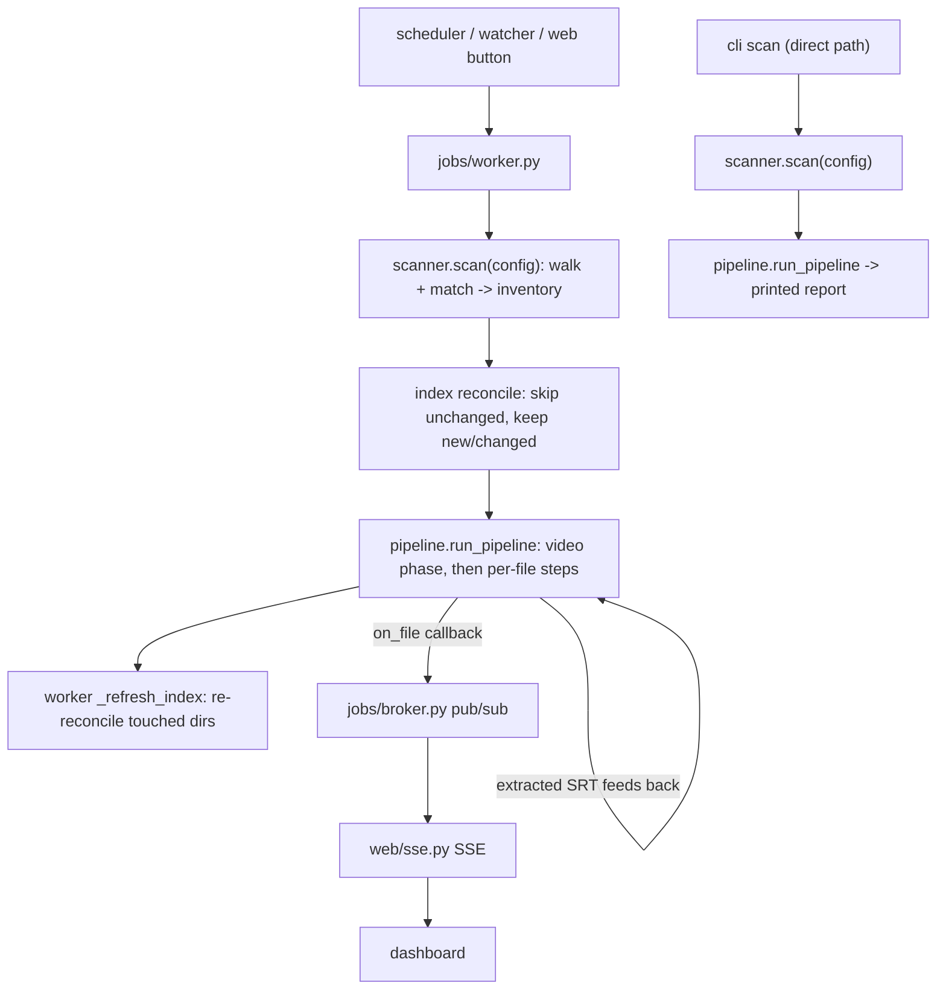

# subtitle_tool package

Authoritative reference for the internals of the `subtitle_tool` package. The root `/AGENTS.md` owns
repo-level layout, development commands, bootstrap settings, and conventions (git, commit format,
writing style) and points here for package detail. Keep the two non-overlapping.

## Subpackage map

Each entry leads with a one-sentence summary of the directory's job and entry point; the detail
beneath it is the behavior to know before editing.

- `config/` - Loads and persists configuration: env-only bootstrap settings plus the validated TOML
  config model. `BootstrapSettings` reads the env-only bootstrap values; `load_config` /
  `save_config` load, validate, and atomically write the TOML config model. `languages.py` is the
  shared catalog of selectable languages (ISO 639-1 code to name) the config form's language pickers
  draw on.
- `subtitle_names.py` - Shared subtitle-filename domain logic; `split_subtitle_name(path)` parses a
  subtitle name into its video basename, language code, and flag tokens. It is a neutral top-level
  module, not under any feature package, because the scanner (to recover the basename to match), the
  index (to record parsed language/flags), and the pipeline's detection and naming steps all read
  it; keeping it here stops any one caller from owning the parsing. Filename-shape knowledge lives
  here; matching rules stay in `scanner/matching.py`.
- `scanner/` - Walks the media paths and pairs subtitles with videos, returning an inventory; entry
  point `scan(config)`. `scanner.py` orchestrates the scan over `walk.py` (recursive walker with
  gitignore-style excludes that follows symlinked directories, tracking each directory's real
  `(st_dev, st_ino)` identity to descend into every real directory once - pruning symlink loops and
  repeated trees, and preferring a real directory over a symlink alias to it), `matching.py`
  (subtitle-to-video matching rules over a basename from `subtitle_tool.subtitle_names`), and
  `models.py` (inventory result models).
- `pipeline/` - Applies the per-file transformations that clean subtitles; entry point
  `run_pipeline(scan_result, config, dry_run=)` in `runner.py`, with an optional `on_file` callback
  for live progress. `runner.py` applies the enabled steps in dependency order; `steps/` holds the
  steps (`encoding`, `conversion`, `cleanup`, `sync`, `detection`, `naming`). The default order runs
  `sync` before `detection`, but when language filtering is enabled the runner detects first so a
  subtitle the filter deletes never pays for the expensive sync alignment; a file the filter marks
  for deletion skips the remaining steps. The reorder is safe because sync only shifts timings, not
  the dialogue the detector reads. The video phase runs first per video group: `video.py`
  (`process_video`) extracts embedded text subtitle streams to external SRT and optionally remuxes
  the video to drop them, `ffmpeg.py` wraps the ffprobe/ffmpeg subprocess calls, and `langcodes.py`
  maps ffprobe's ISO 639-2 tags to the ISO 639-1 codes used in filenames. Extracted files feed back
  into the per-file steps in the same run. The `sync` step (`sync.py`, wrapping the ffsubsync
  subprocess with a per-file timeout) corrects out-of-sync video-matched SRT against the video
  audio, gated on offset, score, and shift thresholds. `safety.py` is the
  temp-file-plus-atomic-replace write layer, `srt.py` a tolerant SRT block model, `workitem.py` the
  mutable per-file state, and `models.py` the action/result reporting types.
- `jobs/` - Runs scans in the background and records their history; entry point the `Worker`
  (`Worker.submit` / `Worker.start`). `worker.py` is the single-job background runner: it takes a
  `ScanRequest` with optional directory scope and collapses triggers arriving mid-job into one
  queued follow-up via `merge_requests`. It reconciles each scan against the media index before
  processing, so unchanged files are skipped and only new/changed paths reach the pipeline; after a
  real run it re-reconciles the directories the pipeline touched (`_refresh_index`, scoped to them)
  so the index reflects renames, deletes, rewrites, and extracted subtitles immediately rather than
  lagging until the next scan. The worker owns orchestration only; `reporting.py` holds the
  reporting/mapping detail it would otherwise accumulate - the `Counters` tally (`record_file`),
  `count_to_process` work estimate, the `to_job_file` result-to-store mapping, and the `file_event`
  SSE payload shaping - so a change to what a run counts or an event carries stays out of the
  worker. `store.py` is the SQLite job history (`JobStore`: jobs, per-file results, retention
  pruning, and marking jobs left `running` by a stopped process as interrupted), `broker.py` the
  in-memory pub/sub bridging the worker thread to SSE subscribers (`EventBroker`), and `models.py`
  the `Job` / `JobFile` records.
- `index/` - The rebuildable SQLite media index (`index.db`) that decides what each scan processes;
  entry point `IndexStore.reconcile`. `store.py` is the `IndexStore`: a `threading.Lock`-guarded
  `sqlite3` connection with videos, subtitles, and a subtitle change/audit-history table.
  `reconcile(scan_result, scope=, dry_run=, recursive=)` fingerprints (size, mtime) the inventory
  against stored rows and returns a `ReconcileResult` (new/changed/unchanged/gone, and
  `process_paths` = new|changed); it loads existing rows once, classifies in memory, and writes
  upserts, history, and in-scope gone markings in batched `executemany` passes, so a large scan
  avoids a query per file (a dry run classifies read-only and writes nothing).
  `library(wanted_languages)` returns `LibraryVideo` coverage with per-video missing wanted
  languages; `models.py` holds the records. Delete `index.db` and a full scan repopulates it;
  `reset()` clears the tables in place for the same effect with the live connection intact (the
  configuration page's index-reset maintenance action calls it).
- `web/` - FastAPI app factory (`create_app`) serving the UI, a JSON API, an SSE stream, and health
  probes. It serves the dashboard, job detail, library, and configuration pages. `sse.py` is the SSE
  stream; `health.py` holds the readiness checks behind `/health/ready` (config directory access and
  a `ping()` on each SQLite store), kept separate from the app factory so they are unit-testable,
  while `/health/live` is liveness and `/health` a deprecated alias. `app.py` is the composition
  root only: lifecycle wiring and route handlers, with page/API logic pushed into focused helpers.
  `library_view.py` holds the library table's server-side `sort_library`/`paginate`; `browse.py`
  holds the directory-picker traversal and root confinement (`browse(root, path) -> BrowseResult`),
  both unit-testable without the app. `forms.py` derives the config form from the model, honouring a
  field's `json_schema_extra` `widget` hint (`language` multi-select from the language catalog,
  `path` directory picker) to choose its input; `serialize.py` shapes job and library JSON;
  `templates/` and `static/` hold the server-rendered UI. `static/app.js` carries two layers:
  vanilla SSE job-progress wiring (live dashboard and job detail), and named `Alpine.data(...)`
  components registered on `alpine:init` for page-local state (`langPicker`, `dirPicker`,
  `libraryView`, `libraryGaps`); the localStorage prefs helpers it keeps are now read/written by
  `libraryView`. Alpine is the pinned `@alpinejs/csp` build vendored at
  `static/vendor/alpine.csp.min.js` and loaded before `app.js`'s Alpine script tag so the
  registration runs before Alpine starts; Jinja/FastAPI stay the source of truth and Alpine only
  manages transient in-page interactivity. The CSP build forbids inline expression evaluation, so
  template expressions hold property/method references only and the logic lives in the components;
  refresh the vendored file with `npm ci && npm run vendor` from `/frontend`. The library view
  (`/library`, `/api/library`) lists indexed videos with their subtitle languages, flags, size,
  modified date, and missing wanted languages from the media index. The HTML page paginates,
  filters, and sorts server-side (`page`, `per_page`, `missing`, and `sort`/`dir` query params over
  the in-memory `library()` list, sorted by `_sort_library` before pagination); the "show gaps only"
  toggle is the `libraryGaps` Alpine component navigating with the `missing` param, sortable column
  headers are plain links carrying `sort`/`dir` (no JavaScript), while column visibility, the
  filename-vs-full-path choice, and a client-side quick filter over the current page's rows are the
  `libraryView` Alpine component (column/path prefs persisted in `localStorage`, with a reset
  action; the quick filter only hides already-rendered rows and never replaces the server-side
  pagination or `missing` filter). The configuration page exposes a maintenance action
  (`POST /config/reset-index`) that calls `IndexStore.reset()` to clear the index and force a full
  reprocess. `/api/browse` lists a container directory's subdirectories for the media-path picker,
  confined to `BootstrapSettings.browse_root`. See `web/AGENTS.md` for the web UI conventions: the
  Jinja/FastAPI/Alpine split, the `static/css/` plain CSS file boundaries and load order, where new
  styles belong, and the local Stylelint command. Avoid duplicating that detail here.
- `scheduler.py` - `Scheduler`: a background thread submitting a full scan on the configured
  interval, with optional scan-on-startup. Re-reads the interval each cycle.
- `watcher.py` - `Watcher`: an inotify (watchdog) observer over the media paths that submits a
  scoped scan when files settle. A `StabilityTracker` debounces events and queues a directory only
  once its files' size and mtime have been stable for the configured window. The worker walks a
  watcher scope non-recursively (`scan_paths(..., recursive=False)`): matching is per-directory, so
  scanning just the changed directory finds every relevant file without re-walking a large subtree.
  Reconcile runs with the matching `recursive=False` so files in unscanned subdirectories are never
  judged gone.
- `logging.py` - Structured JSON logging for container stdout. `configure_logging()` installs one
  stdout handler on the `subtitle_tool` package logger with `StructuredFormatter`, which emits one
  JSON object per line: base fields (timestamp, level, logger, event) plus any structured fields a
  caller passed via `extra`. Modules log through `logging.getLogger(__name__)` with the message as
  the event name. The web app factory configures it; the CLI scan report stays on `print`.
- `cli.py` / `__main__.py` - Console entry point `subtitle-tool` (`scan` / `serve`); `__main__.py`
  delegates to `cli`.

## How a scan flows through these subpackages

A scan is the spine that ties the subpackages together; trace it before changing any one piece:

1. `scanner.scan(config)` walks the media paths, matches subtitles to videos, and returns an
   inventory.
1. The worker (`jobs/worker.py`) reconciles that inventory against the media index (`index/store.py`
   `reconcile`) so unchanged files are skipped; only new/changed paths (`process_paths`) reach the
   pipeline.
1. `pipeline.run_pipeline(...)` runs the video phase first per video group, then the per-file steps
   in dependency order. Extracted files feed back into the per-file steps in the same run.
1. The worker re-reconciles the touched directories (`_refresh_index`) so renames, deletes,
   rewrites, and extractions land in the index immediately.
1. Progress streams via `run_pipeline`'s `on_file` callback → `jobs/broker.py` pub/sub →
   `web/sse.py` SSE → the dashboard.

The scheduler (`scheduler.py`), the watcher (`watcher.py`), and the web dashboard buttons all start
this worker-backed flow. `cli.py scan` is the exception: `_run_scan` calls `scanner.scan` and
`pipeline.run_pipeline` directly and prints a report, so it never goes through the worker,
reconciles against the index, records job history, or streams SSE progress (steps 2, 4, and 5
above).

## Invariants when editing this package

- All file mutations go through `pipeline/safety.py` (temp file + atomic replace). Never write a
  media/subtitle file in place.
- The pipeline stays idempotent and re-runnable: a second scan over unchanged files produces no
  actions.
- Honor `dry_run` everywhere - a dry run classifies and reports planned actions but writes nothing,
  including the index.
- Filenames are the source of truth for language; the index is a rebuildable cache. Keep
  `pipeline/langcodes.py` and `config/languages.py` consistent (ISO 639-1 in filenames).
- Keep concerns separated (see the root `/AGENTS.md` Separation of Concerns section). Shared domain
  logic stays in a neutral module rather than a feature package - subtitle-filename parsing lives in
  `subtitle_names.py`, not under `scanner/`. Orchestration modules stay orchestration: the worker
  delegates reporting/mapping to `jobs/reporting.py`, and the web app factory (`web/app.py`) stays a
  composition root with page/API logic in helpers (`web/library_view.py`, `web/browse.py`,
  `web/health.py`). When a module starts accumulating a second responsibility, extract a focused,
  unit-testable helper rather than growing it.
- `tests/` mirrors this package directory for directory; add tests alongside the module they cover.
