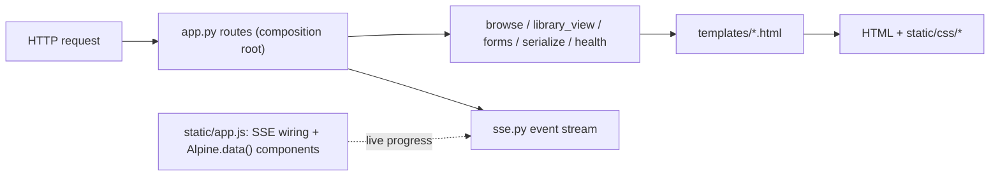

# web UI conventions

Scope-specific guidance for editing the web UI: `templates/`, `static/`, and the browser behavior
they drive. The package map and scan internals live in `../AGENTS.md`; repo-level commands and
conventions live in the root `/AGENTS.md`. Keep the three non-overlapping and point here for web UI
detail.

```text
web/                # FastAPI app factory (create_app), JSON API, SSE, health probes
├── templates/      # server-rendered Jinja pages (base + dashboard/config/library/job/404)
└── static/         # browser assets served as-is
    ├── css/        # project-owned plain CSS, load-ordered tokens -> base -> ... -> tables
    └── vendor/     # pinned Alpine CSP build, refreshed via npm, never hand-edited
```

Request and progress flow through the layer split:



## Stack split

The UI is server-rendered Jinja templates over FastAPI as the source of truth, with Alpine.js as a
thin local-interaction layer for page-local state only. Preserve the split:

- Keep navigation, persistence, and validation server-side in FastAPI routes and Jinja templates.
- Use named `Alpine.data(...)` components in `static/app.js` for transient in-page interactivity
  only (`langPicker`, `dirPicker`, `libraryView`, `libraryGaps`).
- Do not turn the UI into an SPA, add a client-side router, or introduce a frontend bundler or build
  step.
- Alpine is the pinned `@alpinejs/csp` build vendored at `static/vendor/alpine.csp.min.js`. The CSP
  build forbids inline expression evaluation, so template expressions hold property/method
  references only and the logic lives in the components. Refresh the vendored file with
  `npm ci && npm run vendor` from `/frontend`; never hand-edit it.

## CSS file boundaries and load order

Project-owned styles are a small, ordered set of plain CSS files under `static/css/`, loaded
directly by `templates/base.html` with explicit `<link>` tags in dependency order (no `@import`):

1. `tokens.css` - CSS custom properties for colors, surfaces, borders, shadows, radius, z-index, and
   motion, plus the light/dark `prefers-color-scheme` palette. Loaded first so every later file can
   reference these tokens. Adaptive fallbacks redefine only the token values, never component rules:
   `prefers-reduced-transparency`, `prefers-contrast: more`, `forced-colors`, and an
   `@supports not (backdrop-filter)` query swap the translucent `--surface*` tokens for their opaque
   `--surface*-solid` floor and drop `--blur` to `none`, so the layout, borders, and shadows stay
   while transparency is the only thing removed. Design the solid floor first; translucency is the
   enhancement.
1. `base.css` - reset-like rules, the `[x-cloak]` Alpine cloak, document defaults, typography,
   links, `code`, the app shell (sidebar/top navigation, main region), and responsive shell
   behavior. It also holds the two shared accessibility rules: a single `:focus-visible` outline
   covering every interactive control (links, buttons, inputs, `summary` disclosures, tabbable
   pickers) and the `prefers-reduced-motion` block that collapses non-essential transitions and
   animations to near-instant.
1. `components.css` - shared, reusable controls and UI pieces: action rows, buttons, cards/panels,
   notices, tags, status labels, description summaries, progress bars, section headers, pagination.
1. `forms.css` - the generated config form and its inputs: fieldsets, fields, language picker,
   directory picker, advanced disclosure, and the maintenance form panel.
1. `tables.css` - the data-table treatment: scrollable wrappers, sticky headers, sortable header
   affordances, and the library table with its controls, quick filter, and per-column visibility.

Where new styles belong: put a rule in the file that owns its concern. A new shared control goes in
`components.css`; a config-form field in `forms.css`; a library/table treatment in `tables.css`;
shell or document-level rules in `base.css`. Add a sixth file (for example `pages.css`) only for a
real page-specific ownership boundary that cannot fit the files above; prefer the smaller split.

Shared visual values must become a token in `tokens.css` before they are reused, rather than being
duplicated across files. Keep colors, surfaces, borders, blur, shadows, radius, spacing, z-index,
and motion as CSS custom properties referenced throughout.

Do not introduce a CSS framework, preprocessor, bundler, frontend build step, or npm runtime
dependency. Styling stays plain CSS the browser applies directly.

## CSS linting

Project-owned CSS is linted with Stylelint, run through a single pinned `npx` command. Stylelint is
not added to `package.json` and is local git-hook tooling only (not wired into CI for now). The
config is `tools/stylelint.config.cjs`. Run it manually with:

```sh
npx -y -p stylelint@17.13.0 stylelint --config tools/stylelint.config.cjs \
  "src/subtitle_tool/web/static/css/*.css"
```

The `.githooks/pre-commit/40-css.sh` and `.githooks/pre-push/40-css.sh` hooks run the same command
when project CSS is touched. Lint only the files under `static/css/`: vendored assets such as
`static/vendor/alpine.csp.min.js` are never edited or linted as project-owned CSS.
